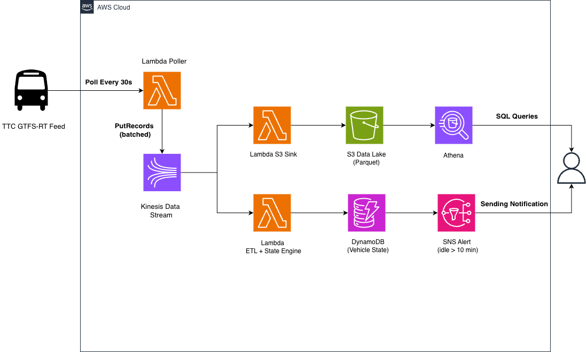

# TTC Real-Time Streaming Pipeline

A cost-optimized, event-driven data pipeline that ingests live GPS positions from every active TTC bus and streetcar, detects vehicles idle for more than 10 minutes, fires SNS alerts, and sinks the full stream to a queryable S3 data lake.

---

## Architecture



**Data source:** [`bustime.ttc.ca/gtfsrt/vehicles`](https://bustime.ttc.ca/gtfsrt/vehicles) — free, no API key, licensed under the Open Government Licence – Toronto.

---

## Project Structure

```
ttc-streaming-pipeline/
│
├── infrastructure/
│   └── template.yaml          # CloudFormation — all AWS resources
│                              # replaces setup.py + teardown.py
│
├── ingestion/
│   └── producer.py            # Lambda: polls TTC feed → Kinesis
│
├── processing/
│   ├── consumer.py            # Lambda: idle detection → SNS + DynamoDB
│   └── s3_sink.py             # Lambda: buffers records → S3 Parquet
│
├── alerts/
│   └── sns_publisher.py       # Shared SNS alert helper
│
├── analysis/
│   └── athena_queries.sql     # Sample queries for pattern analysis
│
└── scripts/
    ├── start_demo.sh          # Calls: aws cloudformation deploy
    └── stop_demo.sh           # Calls: aws cloudformation delete-stack
```

---

## Prerequisites

- Python 3.11+
- AWS CLI v2 configured with an IAM user that has permissions for Kinesis, DynamoDB, S3, SNS, Lambda, CloudFormation, and EventBridge

```bash
# Verify your AWS CLI is configured correctly
aws sts get-caller-identity

# Expected output
{
    "UserId": "AIDAXXXXXXXXXXXXXXXXX",
    "Account": "123456789012",
    "Arn": "arn:aws:iam::123456789012:user/your-user"
}
```

---

## Quick Start

### 1. Clone and install dependencies

```bash
git clone https://github.com/your-username/ttc-streaming-pipeline.git
cd ttc-streaming-pipeline
pip install -r requirements.txt
```

### 2. Configure environment

Create `.env` with your values.

```bash
AWS_ACCOUNT_ID=<YOUR_AWS_ACCOUNT_ID>
AWS_REGION=<AWS-Region>
STACK_NAME=ttc-streaming-pipeline
KINESIS_STREAM_NAME=ttc-vehicle-positions
KINESIS_ENRICHED_STREAM_NAME=ttc-vehicle-enriched
TTC_VEHICLE_URL=https://bustime.ttc.ca/gtfsrt/vehicles
IDLE_THRESHOLD_MINUTES=10
IDLE_RADIUS_METRES=50
DYNAMODB_TABLE_NAME=ttc-vehicle-state
SNS_TOPIC_ARN=<SNS-ARN>
S3_BUCKET_NAME=ttc-data-lake-<YOUR_AWS_ACCOUNT_ID>
```

### 3. Deploy infrastructure

```bash
bash scripts/start_demo.sh
```

This runs:

```bash
aws cloudformation deploy \
  --template-file infrastructure/template.yaml \
  --stack-name ttc-streaming-pipeline \
  --region us-east-1 \
  --parameter-overrides AccountId=YOUR_ACCOUNT_ID
```

### 4. Start streaming

```bash
python ingestion/producer.py      ← Terminal 1: ingest TTC data
python processing/consumer.py     ← Terminal 2: idle detection
python processing/s3_sink.py      ← Terminal 3: sink to S3
```

You should see:

```
Fetched 687 vehicles from TTC
Sent 500 records. Failed: 0
Sent 187 records. Failed: 0
```

### 5. Tear down after your session

```bash
bash scripts/stop_demo.sh
```

Deletes the entire CloudFormation stack. All resources are removed in the correct dependency order and **billing stops immediately**.

---

## Components

### `infrastructure/template.yaml`

CloudFormation template that provisions all AWS resources in `us-east-1`. Replaces both `setup.py` and `teardown.py` — the stack is the single source of truth for your infrastructure.

| Logical ID          | AWS Resource        | Configuration               |
| ------------------- | ------------------- | --------------------------- |
| `TTCVehicleStream`  | Kinesis Data Stream | 1 shard, provisioned        |
| `VehicleStateTable` | DynamoDB Table      | PAY_PER_REQUEST (free tier) |
| `DataLakeBucket`    | S3 Bucket           | Standard storage            |
| `IdleAlertTopic`    | SNS Topic           | Email subscription          |

---

**Output record schema:**

```json
{
  "vehicle_id": "1234",
  "route_id": "504",
  "latitude": 43.6532,
  "longitude": -79.3832,
  "speed_kmh": 34.2,
  "timestamp": 1746123456,
  "ingested_at": 1746123461
}
```

---

## Cost Strategy

Kinesis charges **$0.015/hr per shard** with no free tier. Three tactics keep costs near zero:

**1. Delete the stack after each session**

```bash
bash scripts/stop_demo.sh    # billing stops immediately
bash scripts/start_demo.sh   # back up in ~30 seconds before next demo
```

**2. Batch all records into one PutRecords call**
`producer.py` sends all ~700 vehicle positions as one batch instead of 700 individual PUTs, avoiding Kinesis's per-record billing rounding on every poll cycle.

---

## Skills Demonstrated

- **Stream processing** — Kinesis Data Streams ingestion, consumer fan-out, shard management
- **Event-driven architecture** — Lambda functions, Decoupled producer/consumer, SNS alerting
- **Infrastructure as Code** — CloudFormation with region enforcement via `Rules` block
- **Cost optimization** — on-demand teardown, batched PutRecords, free-tier maximization, peak-hours-only scheduling
- **Data lake design** — Parquet output, date/route partitioning, Athena querying
- **Real-world data** — Live TTC GTFS-Realtime feed, Open Government Licence – Toronto

---

## Data Licence

TTC vehicle position data is published under the [Open Government Licence – Toronto](https://open.toronto.ca/open-data-licence/).

Attribution: _Contains information licensed under the Open Government Licence – Toronto._
